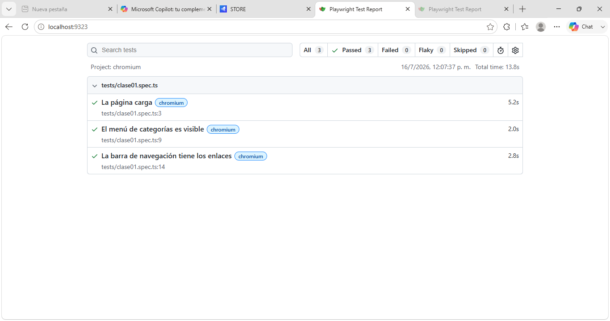

# QA Playwright - Curso 048
 
Aseguramiento de la Calidad del Software · Universidad Mariano Gálvez de Guatemala
Clase 1 · Fundamentos de los Sistemas de Calidad + Setup de Playwright con TypeScript
 
## Datos del estudiante
 
- **Nombre:** [Gelen Dayanna Lopez Morales
- Salvador André Martínez Juárez]
- **Carné:** [1790-21-14904
- 1790-19-6213]
- **Versión de Node.js:** [v22.18.0]
 
## Proyecto
 
Suite de pruebas automatizadas end-to-end con [Playwright](https://playwright.dev/) + TypeScript sobre la aplicación demo [DemoBlaze](https://www.demoblaze.com).
 
### Tests incluidos (`tests/clase01.spec.ts`)
 
1. **La página carga** — verifica el título de la página y que la barra de navegación sea visible.
2. **El menú de categorías es visible** — verifica el elemento `#cat`.
3. **La barra de navegación tiene los enlaces** — verifica los enlaces Home, Contact, About us, Cart, Log in y Sign up.
 
## Cómo ejecutar
 
```bash
npm install
npx playwright install
npx playwright test
npx playwright show-report
```
 
## Resultado de los tests
 
3 de 3 tests pasando:
 


# Evidencias de la Clase 02 — Playwright

## Capturas generadas
Durante la ejecución del archivo `tests/clase02.spec.ts` se generaron **4 capturas de pantalla** en la carpeta `evidencias/`.  
Los archivos corresponden a distintos momentos de la prueba:

- `pagina-inicio.png` → evidencia de la página principal al cargar la aplicación.  
- `carrito-vacio.png` → evidencia del carrito de compras vacío (captura realizada con `fullPage: true`).  
- `detalle-producto.png` → evidencia al visualizar el detalle de un producto en la categoría *Phones*.  
- `navbar.png` → evidencia de la barra de navegación superior.   


## Diferencia entre `fullPage: true` y una captura normal
- **Captura normal**: registra únicamente la parte visible de la ventana del navegador (viewport).  
- **Captura con `fullPage: true`**: recorre toda la página y captura incluso las secciones que requieren desplazamiento vertical.  
Esto permite evidenciar elementos como el **footer**, que no siempre está visible en pantalla.

## Importancia de capturar evidencias en pruebas de software
Las capturas de pantalla son esenciales porque:
- Documentan el estado visual de la aplicación en el momento de la prueba.  
- Facilitan la comunicación de errores al equipo de desarrollo.  
- Sirven como respaldo en auditorías y revisiones de calidad.  
- Permiten validar aspectos gráficos que no se reflejan en los logs.

## Auto-wait vs. `sleep()` en Playwright
- **`sleep()`** introduce pausas fijas en la ejecución, lo que puede generar pruebas frágiles: si la aplicación tarda más, el test falla; si tarda menos, se desperdicia tiempo.  
- **Auto-wait** espera dinámicamente hasta que el elemento esté disponible o la acción sea posible.  

### Ventaja para las pruebas automatizadas
El uso de auto-wait hace que las pruebas sean:
- Más **estables**, porque se adaptan al comportamiento real de la aplicación.  
- Más **rápidas**, al evitar tiempos muertos innecesarios.  
- Más **confiables**, ya que reducen la probabilidad de falsos negativos.

---